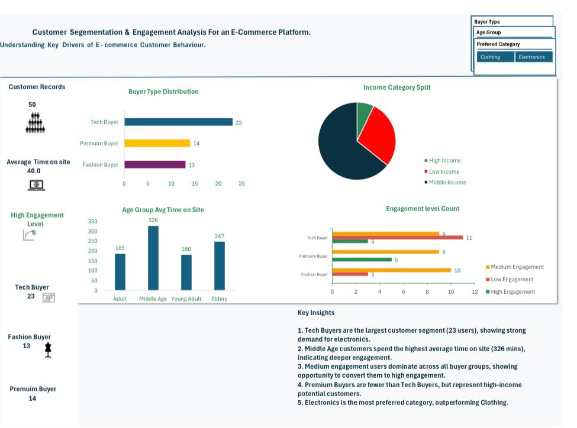

# Customer Segmentation & Engagement Dashboard (Excel)

## Project Overview
This project analyzes customer behavior for an e-commerce platform using Microsoft Excel. The dashboard uncovers patterns in engagement, buyer preferences, income groups, and website activity.

## Tools Used
- Microsoft Excel
- Pivot Tables
- Pivot Charts
- Slicers
- Dashboard Design

## Dashboard Features
- Customer Records KPI
- Average Time on Site
- High Engagement Level KPI
- Buyer Type Distribution
- Income Category Split
- Age Group Average Time on Site
- Engagement Level Count

## Key Insights
1. Tech Buyers are the largest customer segment.
2. Middle Age users spend the highest average time on site.
3. Medium engagement users dominate most groups.
4. Premium Buyers show strong high-income potential.
5. Electronics performs strongly among preferred categories.

## Author
Daubri Blessing
Junior Data Analyst passionate about transforming raw data into business insights.
